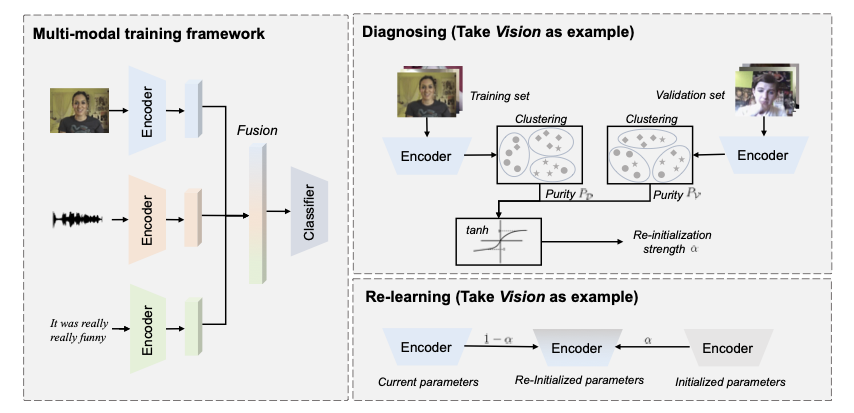

# Code of Diagnosing and Re-learning for Balanced Multimodal Learning
The repo for "Diagnosing and Re-learning for Balanced Multimodal Learning", ECCV 2024

Here is the official PyTorch implementation of ''*Diagnosing and Re-learning for Balanced Multimodal Learning*'', which dynimically diagnose uni-modal learning state and re-initialize uni-modal encoder to enhance both worse-learnt and well-learnt modalities. Please refer to our [ECCV 2024 paper](https://arxiv.org/abs/2407.09705) for more details.

**Paper Title: "Diagnosing and Re-learning for Balanced Multimodal Learning"**

**Authors: [Yake Wei](https://echo0409.github.io/), Siwei Li, Ruoxuan Feng and [Di Hu](https://dtaoo.github.io/index.html)**

## Diagnosing and Re-learning
To overcome the imbalanced multimodal learning problem, where models prefer the training of specific modalities, existing methods propose to control the training of uni-modal encoders from different perspectives, taking the inter-modal performance discrepancy as the basis. However, **the intrinsic limitation of modality capacity is ignored**. The scarcely informative modalities are always recognized as "worse-learnt" ones in existing methods, which could force the model to memorize more noise, counterproductively affecting the multimodal model ability. Moreover, **the current modality modulation methods narrowly concentrate on selected worse-learnt modalities**, even suppressing the training of others. Hence, it is essential to reasonably assess the learning state of each modality and take all modalities into account during balancing. 

To this end, we propose the Diagnosing & Re-learning method. The learning state of each modality is firstly estimated based on the separability of its uni-modal representation space, and then used to softly re-initialize the corresponding uni-modal encoder. In this way, encoders of worse learnt modalities are enhanced, simultaneously avoiding the over-training of other modalities. Accordingly, the multimodal learning is effectively balanced and enhanced.

    

## Code instruction

### Data Preparation
The original datasets can be found:
[CREMA-D](https://github.com/CheyneyComputerScience/CREMA-D),
[Kinetics-Sounds](https://github.com/cvdfoundation/kinetics-dataset),
[UCF101](https://www.crcv.ucf.edu/data/UCF101.php).

The data preprocessing follows [OGM-GE](https://github.com/GeWu-Lab/OGM-GE_CVPR2022).

### Run
The code use CREMA-D dataset as example. You can simply run the code using:  
<pre><code>
cd code
sh script/baseline.sh  
# run baseline
</code></pre>
<pre><code>
cd code
sh script/ours.sh  
# run our Diagnosing and Re-learning method
</code></pre>

## Citation
If you find this work useful, please consider citing it.

<pre><code>
@inproceedings{wei2024diagnosing,
  title={Diagnosing and re-learning for balanced multimodal learning},
  author={Wei, Yake and Li, Siwei and Feng, Ruoxuan and Hu, Di},
  booktitle={European Conference on Computer Vision},
  year={2024}
}
</code></pre>
